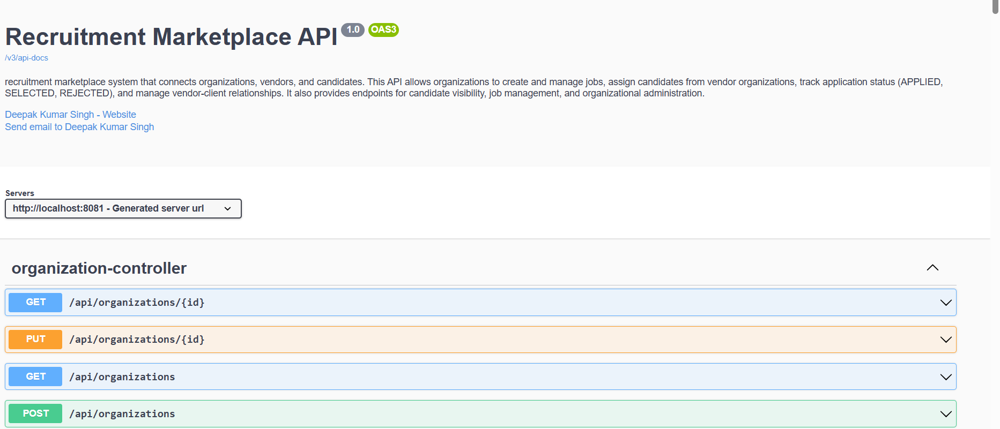
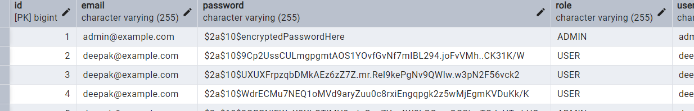

## TalentGo     
 
   
   #### 🔸TalentGo is a mini recruitment marketplace system built using Spring Boot and Java that connects organizations, jobs, and candidates. It allows organizations to create and manage jobs, assign candidates, and establish vendor-client relationships. The system supports role-based access (ADMIN, ORGADMIN, USER), candidate visibility for vendors and clients, and job assignment tracking with statuses like APPLIED, SELECTED, and REJECTED. It includes RESTful APIs, proper database schema design using JPA/Hibernate, and Swagger documentation for easy API exploration.

## Frameworks and Languages and  tools -
1. **Backend:** Java 17, Spring Boot
2. **Database:** MySQL
3. **ORM:** JPA/Hibernate
4. **Validation:** Spring Validation
5. **Security:** Spring Security (role-based access)
6. **API Documentation:** Swagger/OpenAPI
7. **Testing:** JUnit 5, Mockito
8. **Build Tool:** Maven
    

## 📦 Dependencies & Usage

####    This project uses the following Maven dependencies:  

1. **spring-boot-starter-data-jpa** – Dependency used for ORM and database access with JPA/Hibernate in entities and repositories.  
2. **spring-boot-starter-validation** – Dependency used for validating request data with annotations like @NotNull, @Email, @Size.  
3. **spring-boot-starter-web** – Dependency used to build RESTful APIs and handle HTTP requests/responses.  
4. **mysql-connector-j** – Dependency used to connect the application to the MySQL database.  
5. **lombok** – Dependency used to reduce boilerplate code with annotations like @Getter, @Setter, @NoArgsConstructor, @AllArgsConstructor.  
6. **springdoc-openapi-starter-webmvc-ui** – Dependency used to generate Swagger/OpenAPI documentation for all APIs.  
7. **junit-jupiter-api** – Dependency used to write JUnit 5 test cases for service and controller layer testing.  
8. **junit-jupiter-engine** – Dependency used as the JUnit 5 test engine to run test cases.  
9. **mockito-junit-jupiter** – Dependency used for mocking objects and isolating components in unit tests.  
10. **spring-boot-starter-security** – Dependency used for authentication and role-based access control (ADMIN, ORGADMIN, USER).  
11. **spring-boot-starter-test** – Dependency used for unit and integration testing of Spring Boot components.  


## 🔹 Application Properties Configuration

```properties
spring.application.name=TalentGo

# Server port
server.port=8081

# Database configuration
spring.datasource.url=jdbc:mysql://localhost:3306/ttt
spring.datasource.username=root
spring.datasource.password=admin
spring.jpa.properties.hibernate.dialect=org.hibernate.dialect.MySQLDialect
spring.jpa.hibernate.ddl-auto=update
spring.jpa.properties.hibernate.show_sql=true
spring.jpa.properties.hibernate.use_sql_comments=true
spring.jpa.properties.hibernate.format_sql=true

# Allow bean definition overriding
spring.main.allow-bean-definition-overriding=true

# Optional context path
#server.servlet.context-path=/myapp

# Optional Swagger UI path
# springdoc.swagger-ui.path=/swagger-ui/index.html

```
----------------------------------------------------------------------------

## Task Requirements
- **Database:** MySQL (or PostgreSQL)

- **Organization Management:** Create and manage organizations with details like name, address, contact info, and status.

- **Vendor-Client Relationship:** Assign vendors to clients and list vendors/clients.

- **Job Management:** Create and manage jobs with title, description, skills, experience, status, and ownership.

- **Candidate Management:** Add and manage candidates with personal details, skills, experience, and organization ownership.

- **Job Assignment:** Assign candidates to jobs, track status (APPLIED, SELECTED, REJECTED), and validate assignments.

- **Candidate Visibility:** Organizations can view their own and vendor-assigned candidates.

- **Authentication & Authorization:** Role-based access (ADMIN, ORGADMIN, USER) with Spring Security.

- **API Documentation:** Swagger/OpenAPI for all endpoints.

---
   
   ## 🚀 Core Features

1. **Basic Authentication:** Secure endpoints with username/password and role-based access (ADMIN, ORGADMIN, USER).  
2. **Open API / Swagger Documentation:** Interactive API documentation for easy testing and reference.  
3. **CRUD Operations & API Responses:** Standardized RESTful APIs for managing organizations, jobs, candidates, and assignments with meaningful responses.  
4. **Global Exception Handling:** Centralized exception handling for consistent error messages and proper HTTP status codes.  
5. **Vendor-Client Management:** Assign vendors to clients and list all vendors/clients for easy relationship tracking.  
6. **Job Assignment Management:** Assign candidates to jobs with status tracking (APPLIED, SELECTED, REJECTED) and validation.  
7. **Candidate Visibility Control:** Organizations can view their own candidates and candidates from assigned vendors.  
8. **Input Validation:** Ensure valid data using Spring Validation annotations.  
9. **Unit & Integration Testing:** JUnit 5 and Mockito for testing services and controllers.  
10. **Database Management:** Efficient schema design using JPA/Hibernate with MySQL.  


1. **Create Tour Package**  

## 🔹 JobController APIs

1. **POST** `/api/jobs/data/post` – Create a new job  
2. **GET** `/api/jobs/{id}` – Get job by ID  
3. **GET** `/api/jobs/get/list` – Get all jobs  
4. **GET** `/api/jobs/organization/{orgId}` – Get jobs by organization ID  
5. **PUT** `/api/jobs/{id}` – Update job by ID  

## 🔹 OrganizationController APIs

1. **POST** `/api/organizations/post` – Create a new organization  
2. **GET** `/api/organizations/{id}` – Get organization by ID  
3. **GET** `/api/organizations/get/list` – Get all organizations  
4. **PUT** `/api/organizations/{id}` – Update organization by ID  

## 🔹 JobAssignmentController APIs

1. **POST** `/api/job-assignments/post` – Assign a candidate to a job  
2. **GET** `/api/job-assignments/job/{jobId}` – Get all assignments for a specific job  
3. **GET** `/api/job-assignments/candidate/{candidateId}` – Get all assignments for a specific candidate  
## 🔹 UserController APIs

1. **POST** `/api/users/post` – Create a new user  

## 🔹 VendorClientController APIs

1. **POST** `/api/vendor-client/data/post` – Assign a vendor to a client  
2. **GET** `/api/vendor-client/client/{clientId}` – Get vendors for a specific client  
3. **GET** `/api/vendor-client/vendor/{vendorId}` – Get clients for a specific vendor  

## 🔹 CandidateController APIs

1. **POST** `/api/candidates/post` – Create a new candidate  
2. **GET** `/api/candidates/{id}` – Get candidate by ID  
3. **GET** `/api/candidates/get/list` – Get all candidates  
4. **PUT** `/api/candidates/{id}` – Update candidate by ID  
5. **DELETE** `/api/candidates/{id}` – Delete candidate by ID  
6. **GET** `/api/candidates/organization/{orgId}` – Get all candidates for a specific organization  

## 🔹 AdminController APIs

1. **GET** `/api/admin/dashboard` – Get Admin Dashboard welcome message

-------------------------------------------------------


## POSTMAN  

## SWAGGER OPEN API DOCS 


## MYSQL Database 
## POSTGRESQL    

## JUNIT TESTING 

## EXCUTION   


## 🔹 Summary

**TalentGo** is a Spring Boot-based recruitment management system that allows organizations to manage jobs, candidates, and assignments efficiently.  
The project provides **REST APIs** for creating, updating, fetching, and deleting entities like Jobs, Organizations, Candidates, Users, and Vendor-Client mappings.  

Key highlights:  
- Role-based access control with **Spring Security**  
- API documentation using **Swagger/OpenAPI**  
- Exception handling for cleaner API responses  
- Database integration with **MySQL**  
- Testing support with **JUnit 5** and **Mockito**  

This project serves as a backend system for managing recruitment workflows in a structured and secure manner.

             
